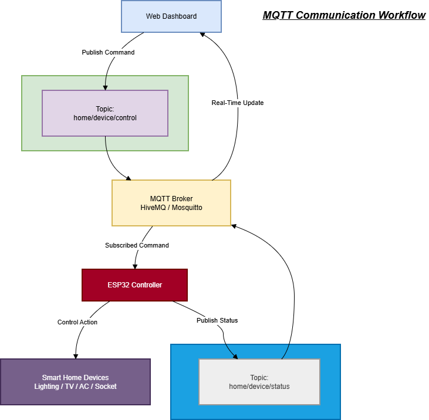
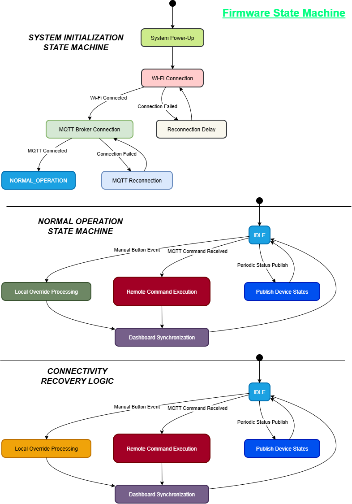
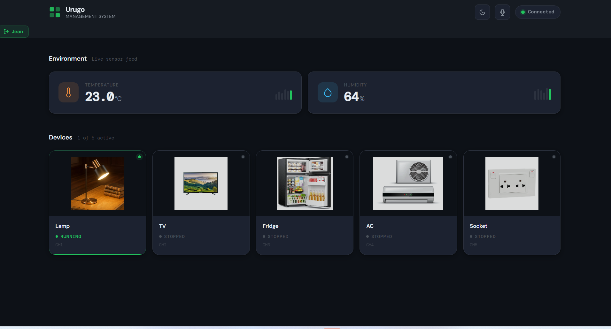
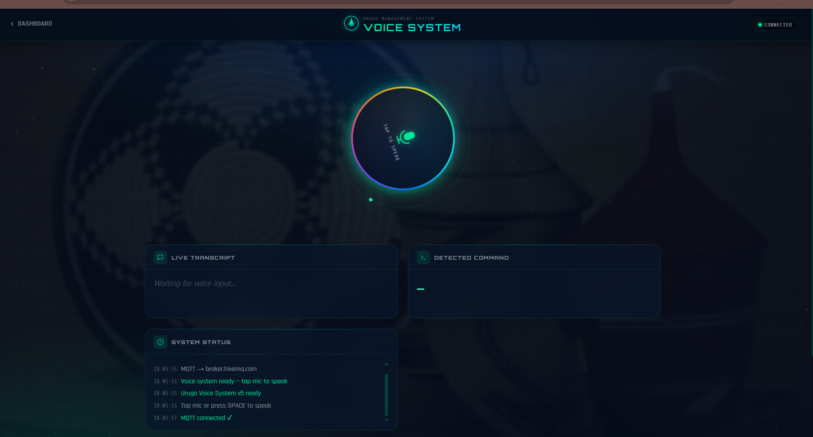
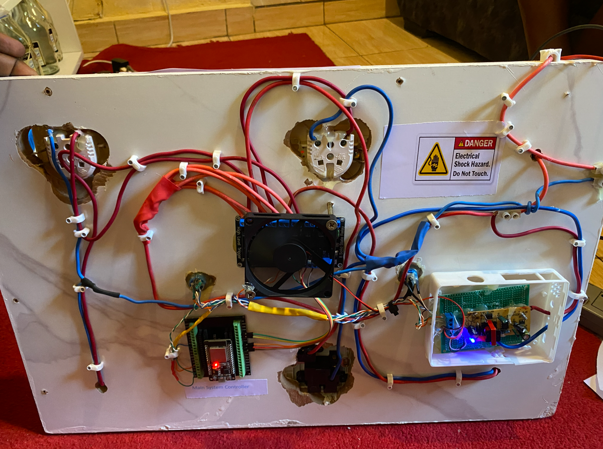
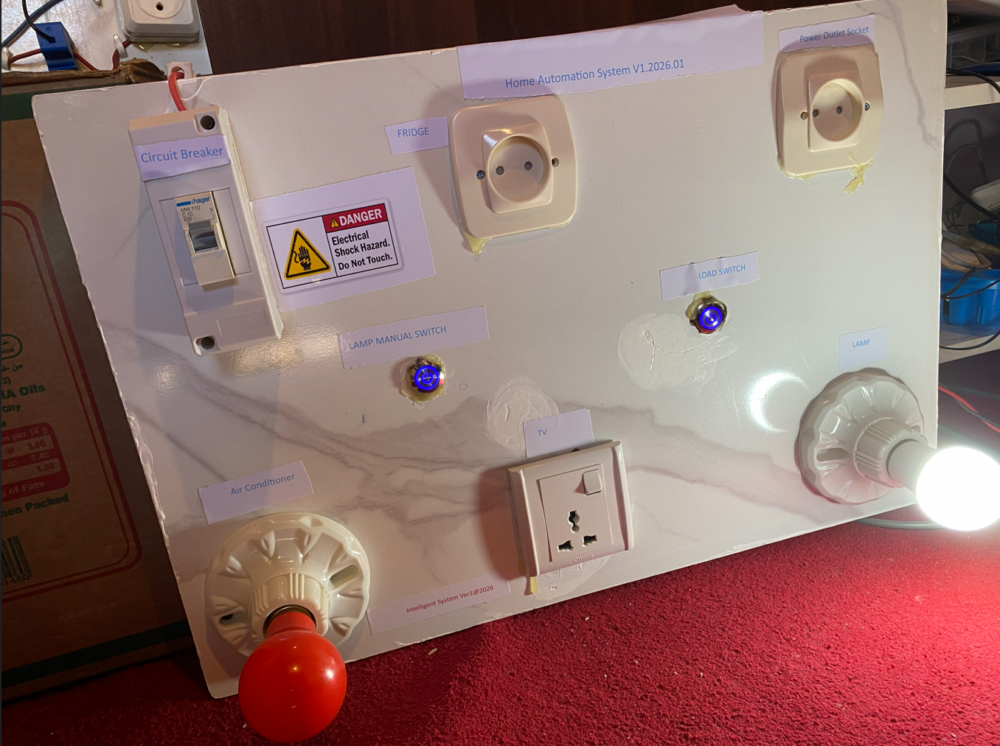

# Energy-Efficient Smart Home Automation Using ESP32, MQTT and AI-Based Voice Command Processing

---

# Overview

This project presents a low-cost, scalable and intelligent smart home automation system designed using an ESP32 microcontroller, MQTT communication protocol, real-time web technologies and AI-assisted voice command processing.

The system enables users to control and monitor household electrical devices through three independent interaction methods:

- Manual local override control using physical push buttons
- Real-time web dashboard control over MQTT
- AI-powered voice-assisted control through browser speech recognition

The architecture was engineered with emphasis on:

- Real-time bidirectional state synchronization
- Reliable MQTT-based communication
- Manual override reliability
- Event-driven firmware architecture
- Low-latency device control
- Human-centered interaction design
- Fault-tolerant network communication

The system continuously synchronizes device states between:

- Embedded hardware
- Web dashboard
- Voice assistant interface

ensuring consistency across all interaction layers.

---

# System Architecture

## High-Level System Block Diagram


---

# MQTT Communication Workflow



---

# Voice Processing Pipeline


---

# Firmware Behavioral Architecture



---

# Manual Override Logic


---

# Dashboard Interface

## Main Dashboard



---

## Voice Assistant Dashboard



---

# Hardware Prototype


_ _ _ 

#Hardware Prototype Cont'd



# System Objectives

The primary objectives of the system are:

- Develop a low-cost smart home automation platform
- Enable real-time device monitoring and control
- Integrate AI-assisted voice interaction
- Ensure reliable local manual override operation
- Maintain synchronized device states across all interfaces
- Reduce dependency on proprietary smart home ecosystems
- Provide scalable MQTT-based communication infrastructure

---

# System Features

## Embedded Smart Control

- ESP32-based embedded controller
- Multi-channel relay switching
- Event-driven firmware design
- GPIO-based manual override inputs

## Real-Time MQTT Communication

- Publish/Subscribe architecture
- Bidirectional state synchronization
- Retained MQTT messages
- Real-time dashboard updates

## AI Voice Assistance

- Browser-based speech recognition
- Voice Activity Detection (VAD)
- AI-assisted command interpretation
- Strict command validation pipeline

## Reliability Features

- Manual override fallback
- MQTT reconnection logic
- Wi-Fi recovery handling
- Debounce state machine logic

---

# Hardware Components

| Component | Purpose |
|---|---|
| ESP32 Development Board | Main embedded controller |
| Relay Module | Electrical load switching |
| Push Buttons | Manual override interface |
| DHT11 Sensor | Environmental sensing |
| Wi-Fi Network | MQTT communication |
| Power Supply | System powering |

---

# Software Stack

| Layer | Technology |
|---|---|
| Embedded Firmware | Arduino Framework |
| Microcontroller | ESP32 |
| Communication Protocol | MQTT |
| MQTT Library | PubSubClient |
| Web Dashboard | HTML/CSS/JavaScript |
| Voice Processing | Browser Speech API |
| AI Processing | LLM API |
| Sensor Interface | DHT Library |

---

# Engineering Design Philosophy

The system was engineered around the concept of:

## Bidirectional Real-Time State Synchronization

This ensures that every control interaction immediately updates all other system interfaces.

For example:

- Manual button press updates dashboard status
- Dashboard command updates physical hardware
- Voice command updates dashboard and relays
- ESP32 publishes live device state changes

This architecture guarantees:

- Operational consistency
- Interface synchronization
- Improved user reliability
- Reduced state mismatch errors

---

# MQTT Communication Architecture

The system uses the MQTT (Message Queuing Telemetry Transport) protocol as the primary communication layer.

MQTT was selected because of its:

- Lightweight architecture
- Low bandwidth consumption
- Low latency
- Publish/Subscribe communication model
- Scalability for IoT systems
- Real-time messaging capability
- Efficient device synchronization

---

# Why MQTT Was Preferred

Compared to traditional HTTP polling architectures, MQTT offers several engineering advantages:

| Feature | MQTT | Traditional HTTP |
|---|---|---|
| Real-Time Communication | Yes | Limited |
| Low Bandwidth Usage | Yes | No |
| Publish/Subscribe Model | Yes | No |
| Device Scalability | High | Moderate |
| Persistent Sessions | Supported | Limited |
| Retained Messages | Supported | No |
| IoT Optimization | High | Low |

MQTT significantly reduces communication overhead while enabling real-time synchronization between distributed system components.

---

# MQTT Broker Infrastructure

The system currently uses:

## Primary Broker

- HiveMQ Public Broker

## Fallback Broker

- Mosquitto MQTT Broker

The fallback architecture improves communication reliability and allows broker redundancy.

---

# MQTT Topic Structure

The system uses structured MQTT topic hierarchies for organized communication.

## Command Topics

```text
bms/device1/cmd/1
bms/device1/cmd/2
bms/device1/cmd/3
```

These topics are used by:

- Dashboard
- Voice assistant

to publish control commands.

---

## State Topics

```text
bms/device1/state/1
bms/device1/state/2
bms/device1/state/3
```

These topics are published by the ESP32 to report:

- ON/OFF state changes
- Synchronization updates

---

## Sensor Topics

```text
bms/device1/temp
bms/device1/humidity
```

These topics publish environmental telemetry data.

---

# MQTT Message Formatting

## Device Command Payload

```text
ON
```

```text
OFF
```

---

## Device State Payload

```json
{
  "state":"ON"
}
```

---

## Sensor Payload Example

```text
24.5
```

---

# MQTT Workflow

The communication workflow operates as follows:

1. User interacts with dashboard or voice assistant
2. Command is converted into MQTT payload
3. Payload is published to MQTT broker
4. ESP32 subscribes to command topic
5. ESP32 executes relay switching logic
6. ESP32 publishes updated device state
7. Dashboard receives synchronized status update

This mechanism enables real-time distributed synchronization.

---

# Manual Override Engineering

The manual override subsystem allows physical local control independent of network availability.

The firmware uses:

- GPIO input monitoring
- Software debounce logic
- Finite state machine processing

to ensure:

- Accurate button detection
- Elimination of false triggers
- Prevention of repeated switching events

---

# Manual Button State Machine

The firmware implements four operational button states:

| State | Purpose |
|---|---|
| BTN_IDLE | Waiting for input |
| BTN_DEBOUNCE_PRESS | Press validation |
| BTN_PRESSED | Stable pressed state |
| BTN_DEBOUNCE_RELEASE | Release validation |

This architecture eliminates missed presses and switch bouncing issues.

---

# Voice Assistance System

The system integrates browser-based voice interaction using:

- Microphone access
- Speech recognition
- AI-assisted command interpretation

The voice system architecture was designed to support natural language interaction while maintaining strict command execution reliability.

---

# Voice Activity Detection (VAD)

The voice interface uses Voice Activity Detection (VAD) to identify the presence of speech before initiating processing.

The VAD subsystem performs:

- Speech presence monitoring
- Silence detection
- Audio threshold analysis
- Microphone activity validation

This improves:

- Voice capture reliability
- Processing efficiency
- Noise filtering
- User interaction responsiveness

---

# Browser-Based Speech Recognition

The dashboard uses browser-native speech recognition APIs to convert user speech into text transcripts.

Processing workflow:

1. User activates microphone
2. Browser captures audio stream
3. Speech recognition engine processes audio
4. Text transcript is generated
5. Transcript forwarded to AI processing layer

This removes the need for dedicated external speech hardware.

---

# AI-Assisted Command Processing

After speech-to-text conversion, the generated transcript is processed through an LLM API.

The AI processing layer performs:

- Natural language interpretation
- Intent extraction
- Command normalization
- Strict command formatting

## User Input

```text
Please turn on the living room light
```

## Parsed System Command

```text
LIGHT_ON
```

---

# Strict Command Parser

The system implements a strict command parser to prevent ambiguous AI outputs.

The parser:

- Validates commands
- Enforces fixed output formatting
- Rejects invalid responses
- Converts AI reasoning into deterministic actions

This improves:

- Execution safety
- Reliability
- Predictable automation behavior

---

# Firmware Architecture

The ESP32 firmware was engineered using an event-driven architecture.

Main firmware responsibilities include:

- Wi-Fi connection handling
- MQTT communication
- Relay control
- Button state management
- Sensor acquisition
- Telemetry publishing
- Reconnection recovery

The firmware implementation is based on:

- Non-blocking timers
- Finite state machines
- Asynchronous event handling

to maximize system responsiveness.

---

# ESP32 Firmware Structure

Main firmware modules include:

| Module | Responsibility |
|---|---|
| handleWiFi() | Wi-Fi recovery |
| handleMQTT() | MQTT reconnection |
| handleButtons() | Button FSM processing |
| handleSensor() | DHT telemetry |
| mqttCallback() | MQTT command processing |
| applyChannel() | Relay state application |

---

# Environmental Monitoring

The system integrates a DHT11 sensor for environmental telemetry.

Measured parameters:

- Temperature
- Humidity

Telemetry is periodically published through MQTT topics for dashboard visualization.

---

# Dashboard System

The dashboard provides:

- Real-time device monitoring
- Relay control interface
- Voice interaction interface
- MQTT connection status
- Environmental telemetry visualization

The interface was engineered for:

- Low latency interaction
- Responsive visualization
- Operational simplicity
- Real-time synchronization

---

# Reliability Mechanisms

The system incorporates several reliability mechanisms.

## Wi-Fi Recovery

Automatic reconnection when Wi-Fi connectivity is lost.

## MQTT Recovery

Automatic broker reconnection and topic resubscription.

## Retained MQTT Messages

Ensures state persistence across reconnections.

## Local Manual Override

Allows operation during dashboard/network failure.

---

# Testing and Validation

The system was tested for:

| Test Category | Validation |
|---|---|
| MQTT Communication | Passed |
| Real-Time Synchronization | Passed |
| Manual Override Reliability | Passed |
| Voice Command Execution | Passed |
| Dashboard Synchronization | Passed |
| Wi-Fi Recovery | Passed |
| MQTT Recovery | Passed |

---

# Scalability

The system architecture supports future expansion including:

- Additional relay channels
- Mobile applications
- Encrypted MQTT communication
- Local/offline AI inference
- Smart scheduling
- Energy analytics
- Home Assistant integration
- Cloud database integration

---

# Repository Structure

```text
smart-home-automation/
│
├── Esp32_firmware
│   
│   
│
├── bms folder containing dashboard Frontend_files
│  
│   
│
├── Photos/
│
│
├── README.md
```

---

# Future Improvements

Planned future enhancements include:

- Offline speech recognition
- Edge AI inference
- TLS-encrypted MQTT communication
- Mobile application deployment
- OTA firmware updates
- Energy consumption analytics
- Role-based user authentication
- Edge-based automation rules

---

# Conclusion

This project demonstrates the implementation of a low-cost, scalable and intelligent smart home automation platform integrating:

- Embedded systems
- MQTT communication
- AI-assisted voice processing
- Real-time dashboards
- Manual override reliability

The architecture emphasizes:

- Synchronization reliability
- Modular engineering
- Low-latency communication
- Scalability
- Practical smart home deployment

The resulting system provides a robust foundation for future IoT and AI-assisted automation research and deployment.
